# DER — Mapeia Focos

> Diagrama de Entidade-Relacionamento gerado com base nos requisitos (RF01–RF21), histórias de usuário (US01–US14) e priorização MoSCoW.
> **Escopo:** Must Have (M) + Should Have (S)
> **Convenção:** Inglês, snake_case

```mermaid
erDiagram

    USER["USER (Usuário)"] {
        uuid id PK
        string name
        string cpf
        string email
        string password_hash
        enum role "citizen | agent | manager"
        boolean is_active
        timestamp created_at
        timestamp updated_at
    }

    OCCURRENCE["OCCURRENCE (Ocorrência)"] {
        uuid id PK
        string description
        enum status "pending | validated | discarded | assigned | inspected | resolved"
        boolean is_anonymous
        uuid reported_by_user_id FK
        uuid location_id FK
        uuid property_id FK
        timestamp created_at
        timestamp updated_at
    }

    LOCATION["LOCATION (Localização)"] {
        uuid id PK
        decimal latitude
        decimal longitude
        string address
        string neighborhood
        string city
        string state
        enum source "gps | manual"
        timestamp created_at
    }

    PROPERTY["PROPERTY (Imóvel)"] {
        uuid id PK
        string address
        string neighborhood
        string city
        string state
        string complement
        decimal latitude
        decimal longitude
        timestamp created_at
        timestamp updated_at
    }

    MEDIA["MEDIA (Mídia)"] {
        uuid id PK
        uuid occurrence_id FK
        string url
        enum type "photo | video"
        string mime_type
        bigint file_size_bytes
        boolean is_public
        timestamp uploaded_at
    }

    TRIAGE["TRIAGE (Triagem)"] {
        uuid id PK
        uuid occurrence_id FK
        uuid manager_id FK
        enum decision "validated | discarded"
        string notes
        timestamp decided_at
    }

    ASSIGNMENT["ASSIGNMENT (Atribuição)"] {
        uuid id PK
        uuid occurrence_id FK
        uuid agent_id FK
        uuid assigned_by_manager_id FK
        timestamp assigned_at
        string notes
    }

    INSPECTION["INSPECTION (Vistoria)"] {
        uuid id PK
        uuid occurrence_id FK
        uuid agent_id FK
        enum result "focus_eliminated | larvicide_applied | property_closed | resident_refused | abandoned_property"
        string notes
        boolean pending_return
        timestamp inspected_at
        timestamp created_at
    }

    STATUS_HISTORY["STATUS_HISTORY (Histórico de Status)"] {
        uuid id PK
        uuid occurrence_id FK
        uuid changed_by_user_id FK
        enum previous_status "pending | validated | discarded | assigned | inspected | resolved"
        enum new_status "pending | validated | discarded | assigned | inspected | resolved"
        string reason
        timestamp changed_at
    }

    NOTIFICATION["NOTIFICATION (Notificação)"] {
        uuid id PK
        uuid recipient_user_id FK
        uuid occurrence_id FK
        string title
        string message
        enum type "status_update | assignment | inspection_result | reminder"
        boolean is_read
        timestamp sent_at
        timestamp read_at
    }

    %% ── Relacionamentos ──────────────────────────────────────

    USER ||--o{ OCCURRENCE          : "reports (citizen)"
    LOCATION ||--|| OCCURRENCE      : "locates"
    PROPERTY ||--o{ OCCURRENCE      : "is subject of"

    OCCURRENCE ||--o{ MEDIA         : "has"
    OCCURRENCE ||--o| TRIAGE        : "goes through"
    OCCURRENCE ||--o{ ASSIGNMENT    : "is assigned via"
    OCCURRENCE ||--o{ INSPECTION    : "results in"
    OCCURRENCE ||--o{ STATUS_HISTORY : "tracks changes"
    OCCURRENCE ||--o{ NOTIFICATION  : "triggers"

    USER ||--o{ TRIAGE              : "decides (manager)"
    USER ||--o{ ASSIGNMENT          : "assigns (manager)"
    USER ||--o{ ASSIGNMENT          : "receives (agent)"
    USER ||--o{ INSPECTION          : "performs (agent)"
    USER ||--o{ STATUS_HISTORY      : "changes"
    USER ||--o{ NOTIFICATION        : "receives"
```

---

## Decisões de Modelagem

| Decisão | Escolha |
|---|---|
| Perfis de usuário | Entidade `USER` com enum `role` (citizen / agent / manager) |
| Imóvel | Entidade `PROPERTY` separada (suporta histórico futuro — RF17) |
| Vistoria | Entidade `INSPECTION` própria com resultado e pendência |
| Status | Entidade `STATUS_HISTORY` para auditoria completa de mudanças |
| Mídias | Entidade `MEDIA` separada com flag `is_public` (privacidade — RN03) |
| Atribuição | Entidade `ASSIGNMENT` registrando gestor, agente e data |
| Localização | Entidade `LOCATION` separada (GPS ou manual — RF05) |
| Notificações | Entidade `NOTIFICATION` com status de leitura |
| Idioma | Inglês (EN), snake_case |
| Escopo | Must Have (M) + Should Have (S) apenas |

---

## Entidades e Responsabilidades

| Entidade | RF cobertos | Ator principal |
|---|---|---|
| `USER` | RF01, RN11 | Todos |
| `OCCURRENCE` | RF02, RF05, RF06, RF08, RF16 | Cidadão |
| `LOCATION` | RF05, RF06, RF14 | Cidadão |
| `PROPERTY` | RF17 (futuro) | Sistema |
| `MEDIA` | RF03, RF04, RF11, RN03 | Cidadão / Agente |
| `TRIAGE` | RF07, RN04, RN13 | Gestor |
| `ASSIGNMENT` | RF15, RN10 | Gestor |
| `INSPECTION` | RF12, RF13, RN07, RN08 | Agente |
| `STATUS_HISTORY` | RF08, RN06 | Sistema |
| `NOTIFICATION` | RF09 | Sistema |
